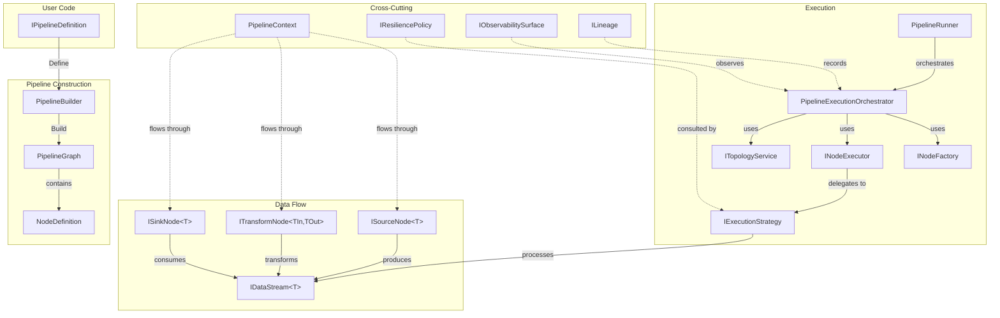

# Architecture Overview

This page is a map of NPipeline's internals. Use it to orient yourself before diving into specific subsystems.

## Component Diagram



## Major Subsystems

### Pipeline Construction (`NPipeline.Pipeline`, `NPipeline.Graph`)

Users define pipelines by implementing `IPipelineDefinition.Define(PipelineBuilder, PipelineContext)`. The builder collects node registrations and connections, then `Build()` produces a `PipelineGraph` — an immutable directed acyclic graph of `NodeDefinition` records connected by typed `Edge` objects.

Key types:

- `PipelineBuilder` — fluent API (split across partial classes: `.Build.cs`, `.Configuration.cs`, etc.)
- `PipelineGraph` / `PipelineGraphBuilder` — immutable graph with validation
- `NodeDefinition` — record holding node metadata (ID, type, kind, input/output types, execution strategy, merge strategy, lineage adapters)
- `NodeKind` — enum: Source, Transform, StreamTransform, Tap, Branch, Lookup, Batch, Sink, Join, Aggregate, Composite, CompositeInput, CompositeOutput

### Execution (`NPipeline.Execution`)

`PipelineRunner` is the main entry point. It delegates to `PipelineExecutionOrchestrator`, which coordinates the full execution lifecycle:

1. **Setup** — instantiate nodes via `INodeFactory`, resolve execution plans
2. **Topology** — `ITopologyService` computes topological order from the graph
3. **Node execution** — `INodeExecutor` executes each node in order, using `IExecutionStrategy` for transforms
4. **Lineage** — `ILineage` records data provenance if enabled
5. **Cleanup** — dispose nodes, streams, and context resources

Key types:

- `PipelineRunner` / `PipelineRunnerBuilder` — public entry points
- `PipelineExecutionOrchestrator` — internal orchestration
- `IExecutionStrategy` — controls how a transform processes its input stream
- `NodeExecutionPlan` — pre-built execution plan for optimized dispatch

### Data Flow (`NPipeline.DataFlow`)

Data flows between nodes as `IDataStream<T>`, which extends `IAsyncEnumerable<T>`. Streams are lazy by default — items are pulled on demand.

Key types:

- `IDataStream<T>` — typed async stream
- `IForwardOnlyDataStream` — marker for streams that cannot be replayed
- `InMemoryDataStream<T>` — buffered collection
- `DataStream<T>` — wraps `IAsyncEnumerable<T>`
- `CappedReplayableDataStream<T>` — bounded replay buffer for materialization

### Nodes (`NPipeline.Nodes`)

All nodes implement `INode` (marker interface extending `IAsyncDisposable`). The three primary interfaces:

- `ISourceNode<TOut>` — `OpenStream(context, ct)` → `IDataStream<TOut>`
- `ITransformNode<TIn, TOut>` — `TransformAsync(item, context, ct)` → `Task<TOut>`
- `ISinkNode<TIn>` — `ConsumeAsync(input, context, ct)` → `Task`

Additional interfaces: `IStreamTransformNode<TIn, TOut>`, `IAggregateNode`, `IJoinNode`, `IBranchNode`, `ILookupNode`, `IBatchNode`, `ICompositeNode`.

### Resilience (`NPipeline.Resilience`, `NPipeline.ErrorHandling`)

`IResiliencePolicy` makes all failure decisions. `ResilientExecutionStrategy` wraps a base strategy with retry, circuit breaker, and dead-letter support. `ResiliencePolicyBuilder` provides the fluent API.

### Configuration (`NPipeline.Configuration`)

Immutable record types: `PipelineRetryOptions`, `PipelineCircuitBreakerOptions`, `ErrorHandlingConfiguration`, `LineageOptions`, `AggregateNodeConfiguration<T>`. All use `with` expressions for modification.

### Observability (`NPipeline.Observability`)

`IObservabilitySurface` receives lifecycle events (pipeline started/completed, node started/completed). Implementations push to logging, metrics, and tracing systems.

### Lineage (`NPipeline.Lineage`)

`ILineage` builds lineage adapters at construction time and records provenance events during execution. Configurable via `LineageOptions`.

## Dependency Direction

Dependencies flow inward. The core `NPipeline` package has no dependency on extension packages. Extensions depend on the core.

```
Extensions → Core ← Connectors
                ↑
          Storage Providers
```

The core is self-contained: pipeline construction, execution, data flow, resilience, and configuration. Extensions add DI, parallelism, composition, testing, observability, and lineage.

## Next Steps

- [Design Principles](design-principles.md) — why the architecture is shaped this way
- [Execution Model](execution-model.md) — deep dive into how the runner works
- [Data Flow Internals](data-flow-internals.md) — stream and pipe implementation details
