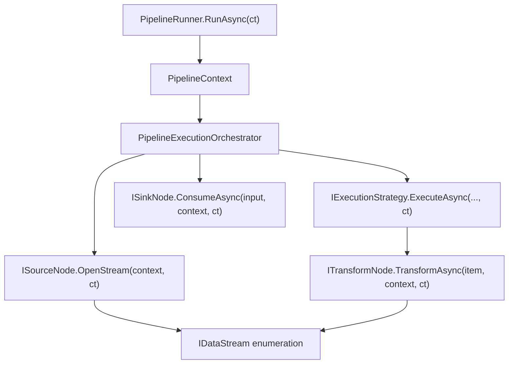

# Cancellation

NPipeline uses .NET's cooperative cancellation model. A `CancellationToken` enters at the runner and propagates through every node, stream, and execution strategy. This page explains the propagation path and what contributors need to know.

## Propagation Path



### Entry

The token enters through `PipelineRunner.RunAsync()`:

```csharp
await runner.RunAsync<MyPipeline>(context, cancellationToken);
```

If no token is provided, `CancellationToken.None` is used. The token is also stored on `PipelineContext` via `PipelineContextConfiguration.WithCancellation(token)`.

### Distribution

The orchestrator passes the token to every node method:

| Node Type | Method Signature |
|-----------|-----------------|
| Source | `OpenStream(PipelineContext context, CancellationToken cancellationToken)` |
| Transform | `TransformAsync(TIn item, PipelineContext context, CancellationToken cancellationToken)` |
| StreamTransform | `TransformAsync(IAsyncEnumerable<TIn> items, PipelineContext context, CancellationToken cancellationToken)` |
| Sink | `ConsumeAsync(IDataStream<TIn> input, PipelineContext context, CancellationToken cancellationToken)` |

Execution strategies also receive the token:

```csharp
IExecutionStrategy.ExecuteAsync<TIn, TOut>(
    IDataStream<TIn> input,
    ITransformNode<TIn, TOut> node,
    PipelineContext context,
    CancellationToken cancellationToken)
```

## Rules for Contributors

### 1. Always Pass the Token

Every async method that accepts a `CancellationToken` must forward it to child operations:

```csharp
// ✓ Correct: token forwarded
public async Task<Order> TransformAsync(
    RawOrder item, PipelineContext context, CancellationToken ct)
{
    var enriched = await _httpClient.GetAsync(item.Url, ct);
    return Map(item, enriched);
}

// ✗ Wrong: token dropped
public async Task<Order> TransformAsync(
    RawOrder item, PipelineContext context, CancellationToken ct)
{
    var enriched = await _httpClient.GetAsync(item.Url); // missing ct!
    return Map(item, enriched);
}
```

The `CancellationTokenRespectAnalyzer` warns about dropped tokens at build time.

### 2. Use WithCancellation on Async Enumerables

When consuming an `IAsyncEnumerable<T>`, always attach the token:

```csharp
await foreach (var item in input.WithCancellation(ct))
{
    // process item
}
```

Without `.WithCancellation()`, the enumeration ignores cancellation requests and continues until the source is exhausted.

### 3. Check Cancellation in Long Loops

For CPU-bound transforms that process items in a tight loop, periodically check the token:

```csharp
public async Task<Batch<T>> TransformAsync(
    Batch<T> batch, PipelineContext context, CancellationToken ct)
{
    var results = new List<T>(batch.Items.Count);
    foreach (var item in batch.Items)
    {
        ct.ThrowIfCancellationRequested();
        results.Add(Process(item));
    }
    return new Batch<T>(results);
}
```

### 4. Handle OperationCanceledException

The orchestrator catches `OperationCanceledException` at the pipeline level. Individual nodes should **not** catch and suppress cancellation exceptions unless they have specific cleanup logic:

```csharp
// ✓ Correct: let cancellation propagate
public async Task ConsumeAsync(
    IDataStream<Order> input, PipelineContext context, CancellationToken ct)
{
    await foreach (var order in input.WithCancellation(ct))
    {
        await _db.InsertAsync(order, ct);
    }
}

// ✗ Wrong: swallowing cancellation
try
{
    await foreach (var order in input.WithCancellation(ct))
    {
        await _db.InsertAsync(order, ct);
    }
}
catch (OperationCanceledException)
{
    // Silently ignoring cancellation prevents pipeline shutdown
}
```

The `OperationCanceledExceptionAnalyzer` detects swallowed cancellation exceptions.

### 5. Cancellation in Execution Strategies

If you're implementing a custom `IExecutionStrategy`, check cancellation before processing each item and between retry attempts:

```csharp
public async Task<IDataStream<TOut>> ExecuteAsync<TIn, TOut>(
    IDataStream<TIn> input,
    ITransformNode<TIn, TOut> node,
    PipelineContext context,
    CancellationToken ct)
{
    async IAsyncEnumerable<TOut> Transform(
        [EnumeratorCancellation] CancellationToken token = default)
    {
        await foreach (var item in input.WithCancellation(token))
        {
            token.ThrowIfCancellationRequested();
            yield return await node.TransformAsync(item, context, token);
        }
    }

    return new DataStream<TOut>(Transform(ct), "my-strategy-output");
}
```

## Cancellation and Resilience

The `ResilientExecutionStrategy` checks the cancellation token between retry attempts. If cancellation is requested during a retry delay (`GetRetryDelayAsync`), the strategy throws `OperationCanceledException` immediately - it does not wait for the delay to complete.

The `CompositeRetryDelayStrategy` also checks:

```csharp
if (cancellationToken.IsCancellationRequested)
    return ValueTask.FromCanceled<TimeSpan>(cancellationToken);
```

## Next Steps

- [Adding a Node Type](../contributing/adding-a-node-type.md) - implement nodes that properly handle cancellation
- [Execution Model](execution-model.md) - how the orchestrator coordinates cancellation
- [Coding Conventions](../contributing/coding-conventions.md) - analyzer rules that enforce cancellation patterns
