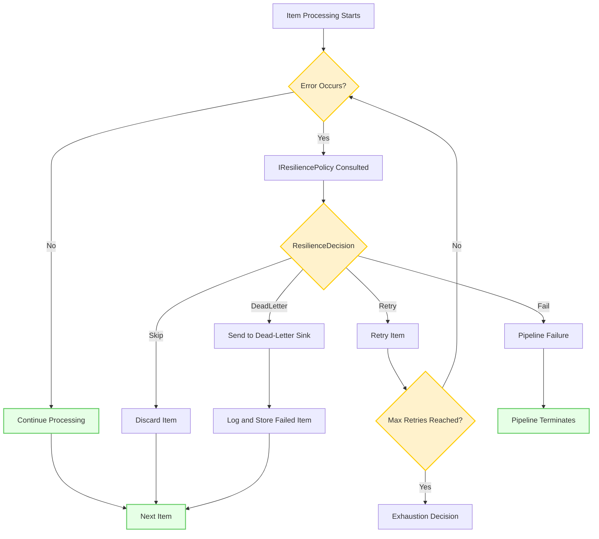

# Error Handling Overview

Robust error handling is critical for building reliable data pipelines. NPipeline provides a unified resilience model that lets you recover from errors, retry operations, or isolate problematic data — without halting the entire pipeline.

## Why Error Handling Matters

By default, if an unhandled exception occurs during pipeline execution, it propagates up the call stack and halts the pipeline. This is appropriate for critical errors, but for many scenarios you want to handle failures selectively and keep processing.

## Types of Errors in NPipeline

Errors fall into three categories:

- **Item-Level Errors**: An exception occurs while processing a single item in a transform node. Other items in the stream are unaffected unless you choose to propagate.
- **Stream-Level Errors**: An entire node's execution stream fails — typically due to infrastructure issues like a database connection dropping or an external service going down.
- **Node-Level Errors**: Errors raised from a node outside of item processing, e.g. from initialization or finalization logic.

## The Unified Resilience Entry Point

All error routing in NPipeline flows through a single interface: [`IResiliencePolicy`](resilience-policy.md).

```csharp
public interface IResiliencePolicy
{
    Task<ResilienceDecision> DecideNodeFailureAsync(...);
    Task<ResilienceDecision> DecidePipelineFailureAsync(...);
    Task<ResilienceDecision> DecideItemFailureAsync<TIn, TOut>(...);
    ValueTask<TimeSpan> GetRetryDelayAsync(...);
    IResilienceCircuitBreaker? GetCircuitBreaker(...);
}
```

| Method | When called |
|---|---|
| `DecideItemFailureAsync` | An individual item fails inside a transform node |
| `DecidePipelineFailureAsync` | An entire node stream fails (used by `ResilientExecutionStrategy`) |
| `DecideNodeFailureAsync` | A node fails outside of item/stream processing |
| `GetRetryDelayAsync` | Before each retry to obtain the delay interval |
| `GetCircuitBreaker` | At node startup when circuit breaking is configured |

Configure a policy pipeline-wide:

```csharp
builder.AddResiliencePolicy<MyResiliencePolicy>();
// or
builder.AddResiliencePolicy(new MyResiliencePolicy());
```

Override for a specific node (item-level decisions only):

```csharp
builder.SetNodeResiliencePolicy(transformHandle, new MyNodePolicy());
```

## ResilienceDecision Values

All three decision methods return a `ResilienceDecision` enum:

| Value | Meaning |
|---|---|
| `Fail` | Stop execution and surface the exception (default) |
| `Retry` | Retry the current item or operation |
| `Skip` | Skip the failing item and continue with the next |
| `DeadLetter` | Route item to the dead-letter sink and continue |
| `RestartNode` | Restart the failed node's entire stream |
| `ContinueWithoutNode` | Remove the node from the pipeline and continue |

## Choosing the Right Decision

### For item-level failures (`DecideItemFailureAsync`)

- **`Retry`** — transient errors: network timeouts, temporary lock contention
- **`Skip`** — non-critical data quality issues where losing the item is acceptable
- **`DeadLetter`** — items that need manual review or reprocessing later
- **`Fail`** — when the error indicates a critical system problem

### For stream-level failures (`DecidePipelineFailureAsync`)

- **`RestartNode`** — transient infrastructure failures where restarting from buffered input makes sense
- **`ContinueWithoutNode`** — non-critical enrichment or optional transformation nodes
- **`Fail`** — when the node is required for correctness

## Implementing a Policy

Extend `ResiliencePolicyBase` and override only the methods you need. All base implementations return `Fail`.

```csharp
public sealed class MyPolicy : ResiliencePolicyBase
{
    // Handle item failures: retry timeouts, skip validation errors
    public override Task<ResilienceDecision> DecideItemFailureAsync<TIn, TOut>(
        ITransformNode<TIn, TOut> node, TIn failedItem, Exception exception,
        PipelineContext context, string nodeId, int retryAttempt, CancellationToken ct)
    {
        return Task.FromResult(exception switch
        {
            TimeoutException => ResilienceDecision.Retry,
            ValidationException => ResilienceDecision.Skip,
            _ => ResilienceDecision.Fail
        });
    }

    // Handle stream failures: restart on transient infrastructure errors
    public override Task<ResilienceDecision> DecidePipelineFailureAsync(
        string nodeId, Exception exception, PipelineContext context, CancellationToken ct)
    {
        return Task.FromResult(exception is TimeoutException or HttpRequestException
            ? ResilienceDecision.RestartNode
            : ResilienceDecision.Fail);
    }
}
```

## Error Flow



## Related Documentation

- [Resilience Policy](resilience-policy.md) — Configure and implement `IResiliencePolicy`
- [Getting Started with Resilience](getting-started.md) — Quick guide for node restarts and retry delays
- [Retries](retries.md) — Configure retry options and delay strategies
- [Dead Letter Queues](dead-letter-queues.md) — Route failed items for later processing
- [Circuit Breakers](circuit-breakers.md) — Prevent cascading failures
