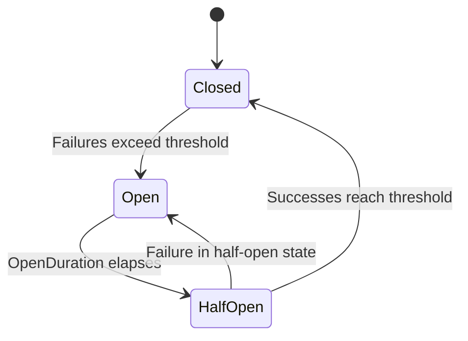

# Circuit Breakers

A circuit breaker monitors failure rates and "trips" when failures exceed a threshold, immediately stopping all execution attempts for the affected node. This prevents a consistently-failing node from wasting resources on doomed retries and allows time for the underlying issue to resolve.

## How It Works

The circuit breaker has three states:



| State | Behavior |
|-------|----------|
| **Closed** | Normal operation. All executions proceed. Failures are counted. |
| **Open** | All executions are blocked immediately. The pipeline fails fast. |
| **Half-Open** | Limited executions are allowed to test recovery. If they succeed, the breaker closes. If they fail, it re-opens. |

## Enabling the Circuit Breaker

Configure it on `PipelineBuilder`:

```csharp
builder.WithCircuitBreaker(
    failureThreshold: 5,
    openDuration: TimeSpan.FromMinutes(1),
    samplingWindow: TimeSpan.FromMinutes(5));
```

This means:

- After **5 consecutive failures**, the breaker opens.
- It stays open for **1 minute** before transitioning to half-open.
- Failure tracking uses a **5-minute rolling window** for statistics.

## Configuration Options

`PipelineCircuitBreakerOptions` controls all circuit breaker behavior:

| Parameter | Default | Description |
|-----------|---------|-------------|
| `FailureThreshold` | 5 | Failures before tripping (must be ≥ 1) |
| `OpenDuration` | 1 minute | How long the breaker stays open |
| `SamplingWindow` | 5 minutes | Rolling window for failure tracking |
| `Enabled` | true | Whether the circuit breaker is active |
| `ThresholdType` | `ConsecutiveFailures` | How failures are counted |
| `FailureRateThreshold` | 0.5 | Rate threshold (0.0–1.0) for rate-based types |
| `HalfOpenSuccessThreshold` | 1 | Successes needed in half-open to close |
| `HalfOpenMaxAttempts` | 5 | Max attempts allowed in half-open state |
| `TrackOperationsInWindow` | true | Whether to track rolling window statistics |

## Threshold Types

The `CircuitBreakerThresholdType` enum determines how the breaker decides when to trip:

### ConsecutiveFailures (default)

Trips after N failures in a row. A single success resets the counter.

```csharp
builder.WithCircuitBreaker(failureThreshold: 5);
```

Best for: Scenarios where occasional failures are acceptable but a streak of failures indicates a real problem.

### RollingWindowCount

Trips when the total failure count within the sampling window exceeds the threshold.

```csharp
var options = new PipelineCircuitBreakerOptions(
    FailureThreshold: 20,
    OpenDuration: TimeSpan.FromMinutes(1),
    SamplingWindow: TimeSpan.FromMinutes(5),
    ThresholdType: CircuitBreakerThresholdType.RollingWindowCount);
```

Best for: High-throughput pipelines where sporadic failures are normal but a burst indicates a problem.

### RollingWindowRate

Trips when the failure rate (failures / total operations) within the window exceeds `FailureRateThreshold`.

```csharp
var options = new PipelineCircuitBreakerOptions(
    FailureThreshold: 10,           // minimum operations before rate is evaluated
    OpenDuration: TimeSpan.FromMinutes(1),
    SamplingWindow: TimeSpan.FromMinutes(5),
    ThresholdType: CircuitBreakerThresholdType.RollingWindowRate,
    FailureRateThreshold: 0.5);     // 50% failure rate trips the breaker
```

Best for: Pipelines with variable throughput where absolute counts are misleading.

## Half-Open Recovery

When the `OpenDuration` elapses, the breaker transitions to half-open. In this state:

1. Up to `HalfOpenMaxAttempts` executions are allowed through.
2. If `HalfOpenSuccessThreshold` consecutive successes occur, the breaker closes (resumes normal operation).
3. If any attempt fails, the breaker re-opens for another `OpenDuration`.

```csharp
var options = new PipelineCircuitBreakerOptions(
    FailureThreshold: 5,
    OpenDuration: TimeSpan.FromMinutes(1),
    SamplingWindow: TimeSpan.FromMinutes(5),
    HalfOpenSuccessThreshold: 3,   // Need 3 successes to fully close
    HalfOpenMaxAttempts: 5);       // Allow up to 5 test attempts
```

## Integration with Resilience Policies

The circuit breaker is accessed through `IResiliencePolicy.GetCircuitBreaker(context, nodeId)`. When using `DefaultResiliencePolicy` or `ResiliencePolicyBase`, the circuit breaker is resolved automatically from `PipelineContext.CircuitBreakerOptions`.

The `IResilienceCircuitBreaker` interface exposed to policies:

```csharp
public interface IResilienceCircuitBreaker
{
    bool CanExecute();
    void RecordSuccess();
    ResilienceCircuitResult RecordFailure();
    ResilienceCircuitSnapshot GetSnapshot();
}
```

The runtime calls `CanExecute()` before each operation and `RecordSuccess()`/`RecordFailure()` after. You don't need to interact with this interface directly unless writing a custom resilience policy.

## Disabling the Circuit Breaker

```csharp
// Use the Disabled preset
var options = PipelineCircuitBreakerOptions.Disabled;
```

## Practical Example

A pipeline reading from an external API with circuit breaker protection:

```csharp
public void Define(PipelineBuilder builder, PipelineContext context)
{
    // Retry with exponential backoff
    builder.WithRetryOptions(options => options with { MaxItemRetries = 3 }
        .WithExponentialBackoffAndFullJitter());

    // Circuit breaker: trip after 5 failures, wait 30s before testing
    builder.WithCircuitBreaker(
        failureThreshold: 5,
        openDuration: TimeSpan.FromSeconds(30),
        samplingWindow: TimeSpan.FromMinutes(2));

    // Resilience policy: retry transient, dead-letter persistent
    var policy = ResiliencePolicyBuilder
        .ForNode<ApiTransform, ApiRequest>()
        .On<HttpRequestException>().Retry(3)
        .On<TaskCanceledException>().Retry(3)
        .OnAny().DeadLetter()
        .Build();

    builder.AddResiliencePolicy(policy);
    builder.AddDeadLetterSink(new BoundedInMemoryDeadLetterSink());

    var source = builder.AddSource<RequestSource, ApiRequest>("requests");
    var transform = builder.AddTransform<ApiTransform, ApiRequest, ApiResponse>("call-api");
    var sink = builder.AddSink<ResponseSink, ApiResponse>("store");

    transform.WithResilience(builder);

    builder.Connect(source, transform);
    builder.Connect(transform, sink);
}
```

When the API starts failing consistently, the circuit breaker trips after 5 failures. For the next 30 seconds, all attempts fail immediately without hitting the API. After 30 seconds, a few test requests are allowed through. If they succeed, normal operation resumes.

## Next Steps

- [Dead-Letter Queues](dead-letter-queues.md) - capture items that fail even after circuit recovery
- [Materialization](materialization.md) - buffer items so nodes can restart after recovery
- [Retry Strategies](retry-strategies.md) - control the delay between retry attempts
