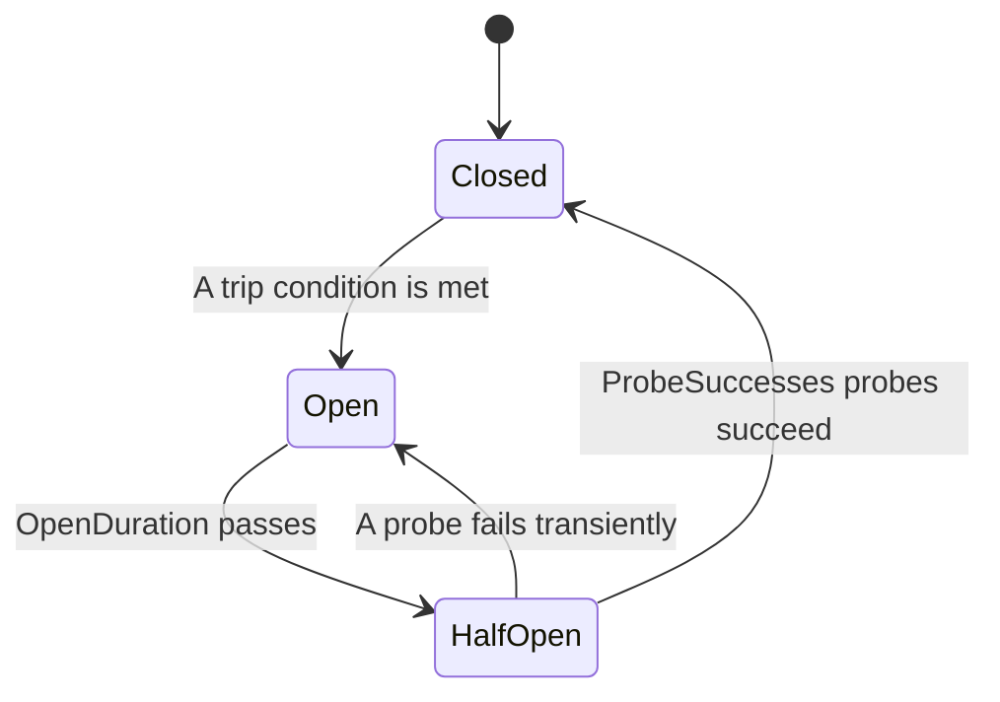

# Circuit breakers

A circuit breaker watches the item attempts of a transform node. When enough attempts fail transiently, the breaker
*opens*, and the node stops making attempts for a while. This spares a dependency that's already down from a flood of
retries, and it makes the pipeline fail fast instead of retrying every item against a service that can't answer.

## How the breaker works

The breaker has three states:


```mermaid
stateDiagram-v2
    [*] --> Closed
    Closed --> Open: A trip condition is met
    Open --> HalfOpen: OpenDuration passes
    HalfOpen --> Closed: ProbeSuccesses probes succeed
    HalfOpen --> Open: A probe fails transiently
```

| State | Behavior |
| --- | --- |
| **Closed** | Every attempt is made. Transient failures count toward the trip conditions. |
| **Open** | No attempt is made. What happens to the item depends on `WhenOpen`. |
| **Half-Open** | Up to `HalfOpenProbes` attempts, called *probes*, are made at a time to test whether the dependency has recovered. |

The breaker guards every attempt of an item's transform, including item retries. With `ItemRetry.MaxRetries = 10` and
a breaker that opens after five failures, a dead dependency sees five attempts, not eleven.

### Only transient failures count

The node's `ItemRetry.Classifier` decides whether a failure is transient. Only transient failures count against the
breaker. A permanent failure, such as a malformed record, says nothing about the health of the dependency, so it
neither trips the breaker nor resets its failure count. Cancelling the pipeline doesn't count either.

For the exceptions that the default classifier treats as transient, see
[Retry strategies](retry-strategies.md#which-failures-are-retried).

## Enable the circuit breaker

Set `CircuitBreaker` in the resilience options, for the whole pipeline or for one transform node:

```csharp
builder.WithResilience(transform, options => options with
{
    ItemRetry = ItemRetryOptions.Default,
    CircuitBreaker = new CircuitBreakerOptions
    {
        ConsecutiveFailures = 5,
        OpenDuration = TimeSpan.FromSeconds(30),
    },
});
```

With these options, the breaker behaves as follows:

- After **five transient failures in a row**, the breaker opens.
- It stays open for **30 seconds**, and then lets one probe through.
- If the probe succeeds, the breaker closes. If it fails transiently, the breaker opens for another 30 seconds.

`CircuitBreakerOptions.Default` has these values. Setting `CircuitBreaker = null`, the default, turns the breaker off.

A breaker only guards transform nodes. Setting one on a source, sink, aggregate, or join node is a build error.

## Configuration options

`CircuitBreakerOptions`, in the `NPipeline.Reliability` namespace, controls the breaker:

| Property | Default | Description |
| --- | --- | --- |
| `ConsecutiveFailures` | `5` | Trip after this many transient failures in a row. `null` disables this condition. |
| `FailureRate` | `null` | Trip when this fraction of the attempts in `Window` failed transiently, from greater than 0 to 1. `null` disables this condition. |
| `MinimumCalls` | `20` | The fewest attempts in `Window` before `FailureRate` is considered. |
| `Window` | 30 seconds | The period `FailureRate` is measured over. |
| `OpenDuration` | 30 seconds | How long the breaker stays open before it lets a probe through. |
| `HalfOpenProbes` | `1` | The most probes in flight at once while half-open. |
| `ProbeSuccesses` | `1` | The successful probes needed to close the breaker. |
| `WhenOpen` | `BreakerOpenBehavior.Fail` | What an attempt does while the breaker is open. See [What happens while the breaker is open](#what-happens-while-the-breaker-is-open). |
| `MaxPause` | 5 minutes | With `WhenOpen = Pause`, the longest one attempt waits before it fails. |

The breaker trips when **any** configured condition is met. At least one of `ConsecutiveFailures` and `FailureRate` must
be set. `Window`, `OpenDuration` and `MaxPause` must each be positive and at most `int.MaxValue` milliseconds (about
24.8 days). `MaxPause` is validated even when `WhenOpen` is `Fail`.

### Trip on a failure rate

A consecutive-failure count suits a dependency that either works or doesn't. For one that degrades, where some calls
succeed and many fail, use a failure rate:

```csharp
CircuitBreaker = new CircuitBreakerOptions
{
    ConsecutiveFailures = null,          // Rate only
    FailureRate = 0.5,                   // Half of the attempts failed transiently
    MinimumCalls = 50,                   // Out of at least 50 attempts
    Window = TimeSpan.FromMinutes(1),    // Within the last minute
},
```

`MinimumCalls` stops the breaker from tripping on a handful of early failures: one failure out of the first two attempts
is a 50% rate, but it isn't evidence of an outage.

## What happens while the breaker is open

**By default, an open breaker fails the item.** Waiting for the breaker instead is opt-in.

### Fail (default)

With `WhenOpen = BreakerOpenBehavior.Fail`, an attempt that the open breaker refuses isn't made. The item fails with a
`CircuitBreakerOpenException`, whose `NodeId` and `State` properties say which breaker refused it and in what state.

The resilience policy sees the refusal as a failure with `ItemFailure.IsBreakerOpen` set to `true`. The default policy
fails the node, even when `OnItemFailure` is `Skip` or `DeadLetter`. Otherwise, one outage would skip or dead-letter
every remaining item in the input. If the refused attempt was a retry, the node fails with a `RetryExhaustedException`
whose inner exception is the `CircuitBreakerOpenException`.

A custom policy can choose differently. For example, it can return `ResilienceDecision.DeadLetter` for a refused
attempt when dead-lettering during an outage is what you want.

A policy built with `ResiliencePolicyBuilder` follows the default while the breaker is open: its rules match
`CircuitBreakerOpenException` like any other exception, but they are not consulted for a refused attempt. A refused
attempt fails the node instead, so a `.OnAny().Skip()` or `.OnAny().DeadLetter()` rule cannot drain the input while the
dependency is down. The `Pause` mode is the way to wait out an outage.

### Pause (opt-in)

To make an attempt wait for the breaker instead of failing, set `WhenOpen` to `BreakerOpenBehavior.Pause`:

```csharp
CircuitBreaker = new CircuitBreakerOptions
{
    ConsecutiveFailures = 5,
    OpenDuration = TimeSpan.FromSeconds(30),
    WhenOpen = BreakerOpenBehavior.Pause,   // Opt in: wait for the breaker instead of failing
    MaxPause = TimeSpan.FromMinutes(10),    // But never longer than 10 minutes for one attempt
},
```

With `Pause`, an attempt that the breaker refuses waits until the breaker lets a probe through, and then makes the
attempt as a probe. While it waits, the node reads no more input, so upstream nodes are held back by backpressure and no
item is lost or skipped. For a data pipeline, *stop reading until the dependency recovers* is often the right
behavior.

A pause is bounded in two ways:

- **`MaxPause`.** If the breaker is still open after `MaxPause`, the attempt fails with a `CircuitBreakerOpenException`,
  exactly as it would with `Fail`.
- **Cancellation.** Cancelling the pipeline ends the pause at once with an `OperationCanceledException`.

Use `Pause` when the dependency usually recovers on its own and a late result is better than none. Keep the default,
`Fail`, when the pipeline is scheduled to run again soon, or when a stalled pipeline would be worse than a failed one.

## Breaker lifetime

A node's breaker lives as long as the `PipelineFactory` that built the pipeline, not just for one run. `AddNPipeline()`
registers the factory as a singleton, and `PipelineRunner.Create()` creates one per runner, so reusing a runner reuses
its breakers.

This matters for a pipeline that runs often. If a run opens the breaker because a dependency is down, the next run,
started a few seconds later, fails at its first attempt without calling the dependency. After `OpenDuration`, a run
probes the dependency and, if it has recovered, carries on normally.

Each pipeline definition type has its own breakers, one per node. If you change a node's `CircuitBreakerOptions` or its
`Time` provider, the node gets a new breaker, which starts closed.

## Observe the breaker

Every state change raises `IExecutionObserver.OnCircuitStateChanged` with a `CircuitStateChangedEvent`, which carries
the node id, the previous and new states, and the reason for the change. The Observability extension counts transitions
to `Open` as the node's `CircuitBreakerTrips`. For more information, see [Observability](../extensions/observability.md).

An open breaker becomes half-open when the next attempt is asked for after `OpenDuration`, not on a timer. The
`Open` to `HalfOpen` event is raised at that moment, by the run that makes the attempt.

## Test with a fake clock

The breaker reads time from `PipelineResilienceOptions.Time`. In tests, set it to a `FakeTimeProvider` from
`Microsoft.Extensions.TimeProvider.Testing` and advance the clock instead of waiting out `OpenDuration`:

```csharp
var time = new FakeTimeProvider();

builder.WithResilience(transform, options => options with
{
    CircuitBreaker = new CircuitBreakerOptions { ConsecutiveFailures = 2, OpenDuration = TimeSpan.FromMinutes(1) },
    Time = time,
});

// ... run until the breaker opens ...

time.Advance(TimeSpan.FromMinutes(1)); // The next attempt is a probe.
```

## Example: pause while an API is down

The following pipeline calls an external API. It retries transient failures, stops calling the API while it's down, and
waits up to five minutes for it to recover before it fails:

```csharp
public void Define(PipelineBuilder builder, PipelineContext context)
{
    var source = builder.AddSource<RequestSource, ApiRequest>("requests");
    var transform = builder.AddTransform<ApiTransform, ApiRequest, ApiResponse>("call-api");
    var sink = builder.AddSink<ResponseSink, ApiResponse>("store");

    builder.WithResilience(transform, options => options with
    {
        ItemRetry = ItemRetryOptions.Default,               // Three retries of transient failures
        OnItemFailure = ItemFailureAction.DeadLetter,       // Permanent failures go to the dead-letter sink
        CircuitBreaker = new CircuitBreakerOptions
        {
            ConsecutiveFailures = 5,
            OpenDuration = TimeSpan.FromSeconds(30),
            WhenOpen = BreakerOpenBehavior.Pause,
            MaxPause = TimeSpan.FromMinutes(5),
        },
    });

    builder.AddDeadLetterSink(new BoundedInMemoryDeadLetterSink());

    builder.Connect(source, transform);
    builder.Connect(transform, sink);
}
```

When the API starts failing, the breaker opens after five transient failures in a row. The node stops reading requests,
and every 30 seconds one request is sent as a probe. When a probe succeeds, the breaker closes and the node carries on
from where it stopped. If the API is still down after five minutes, the node fails. Malformed requests, which fail
permanently, go to the dead-letter sink and never trip the breaker.

## Next steps

- [Dead-letter queues](dead-letter-queues.md): capture items that fail permanently.
- [Retry strategies](retry-strategies.md): control which failures are retried and how long to wait between attempts.
- [Resilience policies](resilience-policies.md): decide what happens to a refused attempt yourself.
