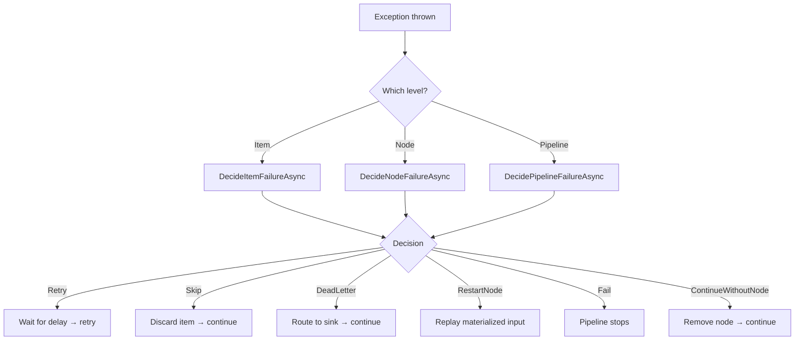

# Error Handling

NPipeline distinguishes three levels of failure. Each level has different causes, different recovery options, and different configuration points.

## The Three Failure Levels

### Item-Level Failures

An individual item throws an exception during processing inside a transform node. The item fails, but the stream can continue.

**Example:** A single malformed record causes a `FormatException` in a CSV parser while other records process normally.

**Recovery options:** Retry the item, skip it, or route it to a dead-letter queue.

### Node-Level Failures

An entire node fails - typically because its stream is exhausted or an unrecoverable error occurs (e.g., a database connection drops mid-stream).

**Example:** A source node's HTTP connection times out after the stream has started.

**Recovery options:** Restart the node (replaying materialized items), continue without the node, or fail the pipeline.

### Pipeline-Level Failures

The pipeline itself cannot continue - either because a critical node failed with no recovery path, or because a circuit breaker tripped.

**Example:** A circuit breaker opens after 5 consecutive node restart failures.

**Recovery options:** Fail fast with a clear error message. Investigate and fix the root cause.

## Decision Model

When a failure occurs, NPipeline consults your **resilience policy** to decide what to do. The policy returns one of six decisions:

| Decision | Meaning |
|----------|---------|
| `Fail` | Stop the pipeline immediately. Surface the exception. |
| `Retry` | Retry the failed operation (with configured delay). |
| `Skip` | Discard the failed item and continue processing. |
| `DeadLetter` | Route the failed item to a dead-letter sink for later inspection. |
| `RestartNode` | Restart the entire failed node from its materialized input. |
| `ContinueWithoutNode` | Remove the failed node and continue the pipeline without it. |

These decisions are defined in the `ResilienceDecision` enum (`NPipeline.Resilience` namespace).

## Default Behavior

The default error handling behavior depends on the [optimization profile](../guides/optimization-profiles.md):

**Default profile:** NPipeline auto-configures item-level retries (3 attempts, exponential backoff with full jitter, 10,000-item materialization cap). Failed items are retried automatically before the pipeline fails. No explicit configuration is required.

**HighThroughput profile:** NPipeline uses `DefaultResiliencePolicy` which returns `Fail` for all failure types. Any unhandled exception fails the pipeline immediately - no items are retried or skipped automatically. You opt into recovery behaviors explicitly.

In both profiles:

- No dead-letter routing occurs unless you configure a dead-letter sink.
- No resilience policy is active unless you add one via `AddResiliencePolicy()`.
- The fail-fast behavior for *unhandled* failures (those exceeding retry limits or not covered by a policy) is intentional - silent data loss is worse than a loud failure.

## Configuring Error Handling

Error handling is configured on the `PipelineBuilder` inside your pipeline definition:

```csharp
public class MyPipeline : IPipelineDefinition
{
    public void Define(PipelineBuilder builder, PipelineContext context)
    {
        // 1. Configure retry options (override auto-configured defaults if needed)
        builder.WithRetryOptions(options => options with
        {
            MaxItemRetries = 5,
            MaxNodeRestartAttempts = 2,
            MaxMaterializedItems = 1000
        });

        // 2. Add a resilience policy (decides what to do on failure)
        builder.AddResiliencePolicy(myPolicy);

        // 3. Add a dead-letter sink (where failed items go)
        builder.AddDeadLetterSink(new BoundedInMemoryDeadLetterSink());

        // 4. Configure circuit breaker (prevents cascading failures)
        builder.WithCircuitBreaker(
            failureThreshold: 5,
            openDuration: TimeSpan.FromMinutes(1),
            samplingWindow: TimeSpan.FromMinutes(5));

        // ... add nodes and connections ...
    }
}
```

Or use the `WithRetry()` shorthand for sensible defaults without specifying individual values:

```csharp
builder.WithRetry();  // Applies retry defaults for the active optimization profile
```

## How Failures Flow



## Enabling Resilience on a Node

To enable retry/restart behavior on a specific transform node, call `.WithResilience()`:

```csharp
var transform = builder.AddTransform<MyTransform, string, string>("my-transform");
transform.WithResilience(builder);
```

This wraps the node's execution strategy with `ResilientExecutionStrategy`, which integrates with your resilience policy, retry delays, and circuit breaker.

> **Note:** Resilience is only applicable to transform nodes. Source and sink nodes handle errors through the node-level and pipeline-level decision methods.

## Key Namespaces

| Namespace | Contains |
|-----------|----------|
| `NPipeline.Resilience` | `IResiliencePolicy`, `ResiliencePolicyBase`, `ResilienceDecision` |
| `NPipeline.ErrorHandling` | `ResiliencePolicyBuilder`, `IDeadLetterSink`, `DeadLetterEnvelope` |
| `NPipeline.Configuration` | `PipelineRetryOptions`, `PipelineCircuitBreakerOptions` |
| `NPipeline.Execution.RetryDelay` | `IRetryDelayStrategy`, `BackoffStrategies`, `JitterStrategies` |

## In This Section

- [Resilience Policies](resilience-policies.md) - implement custom decision logic with the fluent builder
- [Retry Strategies](retry-strategies.md) - configure exponential, linear, or fixed backoff with jitter
- [Circuit Breakers](circuit-breakers.md) - prevent cascading failures with automatic trip/recovery
- [Dead-Letter Queues](dead-letter-queues.md) - capture and inspect failed items
- [Materialization](materialization.md) - buffer streaming inputs to enable node restart
