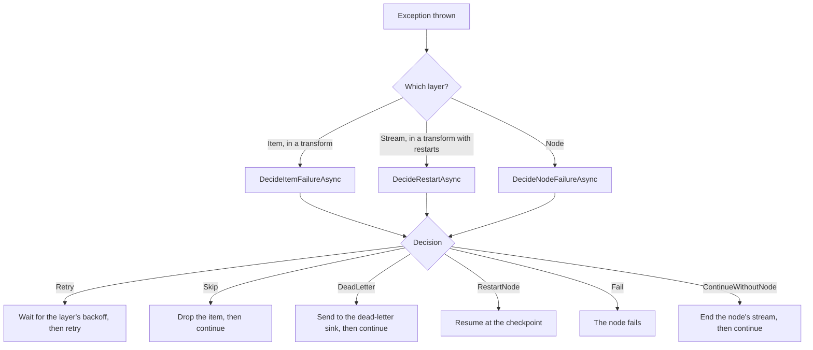

# Error handling

When a node fails, NPipeline can retry the work, set the failed item aside, or fail the pipeline. This section explains
how to choose between them, and how to configure each one.

## What can fail

Failures happen at three levels. Each level has different causes and different ways to recover:

- **An item.** One item throws an exception inside a transform node, and the rest of the stream is unaffected. For
  example, one malformed record causes a `FormatException` while the other records process normally. You can retry the
  item, skip it, or send it to a dead-letter queue.
- **A node.** A node's stream fails, or the node can't start. For example, a transform loses a connection it holds, or
  a source can't open its connection at startup. You can restart a transform from its checkpoint, retry a node that
  failed before it read any input, continue without the node, or fail the pipeline.
- **The pipeline.** A node failed and nothing recovered it. The pipeline fails with the node's exception, so you can
  investigate and fix the cause.

NPipeline recovers from these failures at three layers: item retry, node restart, and node retry. The connectors add
their own retries for calls to external systems. For more information, see
[The three resilience layers](three-layers.md).

## Decisions

When a failure occurs, NPipeline asks a *resilience policy* what to do. The policy returns one of six decisions, which
the `ResilienceDecision` enum defines:

| Decision | Meaning |
| --- | --- |
| `Fail` | Fail the node, and with it the pipeline. |
| `Retry` | Retry the failed work, after the layer's backoff. |
| `Skip` | Drop the failed item and continue. |
| `DeadLetter` | Send the failed item to the dead-letter sink and continue. |
| `RestartNode` | Restart the failed transform from its checkpoint, the first item whose outcome it hasn't delivered. |
| `ContinueWithoutNode` | End the failed node's stream and continue the pipeline without it. |

## Default behavior

Each node's `PipelineResilienceOptions` describe what is retried, and `DefaultResiliencePolicy` carries them out. The
options start from the [optimization profile](../guides/optimization-profiles.md):

- **Default profile:** transient item failures are retried up to three times, with exponential backoff from 200
  milliseconds up to 30 seconds and full jitter (`ItemRetryOptions.Default`).
- **HighThroughput profile:** nothing is retried (`PipelineResilienceOptions.None`).

Transient failures include the following:

- `TimeoutException`, `IOException`, and `SocketException`.
- `HttpRequestException` with no status code, or with status 408, 429, or 5xx.
- `DbException` when `IsTransient` is `true`.
- `TaskCanceledException`, unless the pipeline's own cancellation token caused it.

Any other failure fails the node at once, so a programming error isn't retried. For the full rules, see
[Retry strategies](retry-strategies.md#which-failures-are-retried).

In both profiles, the following also applies:

- An item that isn't retried fails the node, unless you set `OnItemFailure` to `Skip` or `DeadLetter`.
- Node restart (`NodeRestart`) and node retry (`NodeRetry`) are off until you configure them.
- A failure that nothing recovers fails the pipeline. This is intentional: silent data loss is worse than a loud
  failure.
- `OnItemFailure = DeadLetter` without a dead-letter sink stops the run before any node starts. A custom policy that
  returns `DeadLetter` without a sink fails the node with `DeadLetterSinkNotConfiguredException`
  ([NP0424](../reference/error-codes.md)). An item is never dropped silently.

A custom policy that you register with `AddResiliencePolicy()` makes the decisions instead. The node's limits reach it
as advice, through `failure.MaxRetries` and `failure.CanRetry`. The runtime doesn't override its answer, except that
repeating the same work more than 100 times fails the node. For more information, see
[Resilience policies](resilience-policies.md).

## Configure error handling

You configure error handling on the `PipelineBuilder`, in your pipeline definition:

```csharp
public class MyPipeline : IPipelineDefinition
{
    public void Define(PipelineBuilder builder, PipelineContext context)
    {
        // 1. Configure the pipeline's resilience options, starting from the profile's defaults.
        builder.WithResilience(options => options with
        {
            ItemRetry = options.ItemRetry with { MaxRetries = 5 },
            OnItemFailure = ItemFailureAction.DeadLetter,
            CircuitBreaker = new CircuitBreakerOptions { ConsecutiveFailures = 5, OpenDuration = TimeSpan.FromMinutes(1) },
        });

        // 2. Add a dead-letter sink, where failed items go.
        builder.AddDeadLetterSink(new BoundedInMemoryDeadLetterSink());

        // 3. Optionally, add a resilience policy with your own decision logic.
        builder.AddResiliencePolicy(myPolicy);

        // ... add nodes and connections ...
    }
}
```

A node's options derive from the pipeline's. To override them for one node, pass its handle to `WithResilience`:

```csharp
builder.WithResilience(enrich, options => options with
{
    ItemRetry = options.ItemRetry with { MaxRetries = 10 },
});
```

Item retry, node restart, and the circuit breaker apply only to transform nodes. Setting them on a source, sink,
aggregate, or join node is a build error. Node retry applies to any node, but covers setup only: once a node has read
input, it isn't executed again. Sinks and sources recover from mid-stream failures through their connector's retries.

## How failures flow

The following diagram shows how a failure reaches a decision, and what each decision does:


```mermaid
flowchart TD
    A[Exception thrown] --> B{Which layer?}
    B -->|Item, in a transform| C[DecideItemFailureAsync]
    B -->|Stream, in a transform with restarts| D[DecideRestartAsync]
    B -->|Node| E[DecideNodeFailureAsync]
    C --> F{Decision}
    D --> F
    E --> F
    F -->|Retry| G[Wait for the layer's backoff, then retry]
    F -->|Skip| H[Drop the item, then continue]
    F -->|DeadLetter| I[Send to the dead-letter sink, then continue]
    F -->|RestartNode| J[Resume at the checkpoint]
    F -->|Fail| K[The node fails]
    F -->|ContinueWithoutNode| L[End the node's stream, then continue]
```

An item failure that isn't resolved fails the node's stream. If the node has restarts configured, that stream failure
goes to `DecideRestartAsync`, so the layers escalate from the item to the node.

## Restart a transform

To make a transform restartable, set its `NodeRestart.MaxRestarts` above zero. The builder then wraps the node for
restart, and there's no separate call to make. The node restarts as often as the policy answers `RestartNode`, which
the default policy does until `MaxRestarts` is reached. It waits for `NodeRestart.Backoff` between runs:

```csharp
builder.WithResilience(transform, options => options with
{
    NodeRestart = new NodeRestartOptions { MaxRestarts = 3 },
});
```

A restart resumes at the node's checkpoint, so it doesn't deliver items twice or buffer the whole input. For more
information, see [Node restart and the replay window](materialization.md).

## Key namespaces

The following namespaces contain the resilience types:

| Namespace | Contains |
| --- | --- |
| `NPipeline.Reliability` | `PipelineResilienceOptions`, `ItemRetryOptions`, `NodeRestartOptions`, `NodeRetryOptions`, `CircuitBreakerOptions`, `BreakerOpenBehavior`, `RetryBackoff`, `RetryClassifier`, `IResiliencePolicy`, `ResiliencePolicyBase`, `DefaultResiliencePolicy`, `ResilienceDecision` |
| `NPipeline.ErrorHandling` | `ResiliencePolicyBuilder`, `IDeadLetterSink`, `DeadLetterEnvelope`, `RetryExhaustedException`, `CircuitBreakerOpenException`, `DeadLetterSinkNotConfiguredException` |

## In this section

- [The three resilience layers](three-layers.md): what each layer retries, and how connector retries compose with them.
- [Resilience policies](resilience-policies.md): make decisions in code, or with the fluent builder.
- [Retry strategies](retry-strategies.md): choose the backoff, the jitter, and which failures are retried.
- [Circuit breakers](circuit-breakers.md): stop calling a dependency that keeps failing, and fail or pause until it
  recovers.
- [Dead-letter queues](dead-letter-queues.md): capture and inspect failed items.
- [Node restart and the replay window](materialization.md): how a transform resumes from its checkpoint, and what a
  restart guarantees.
