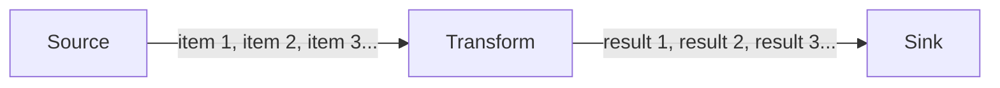
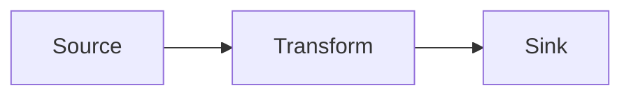
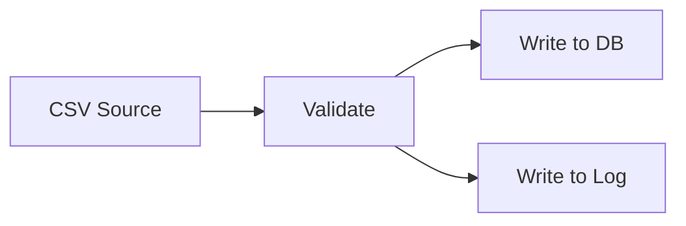
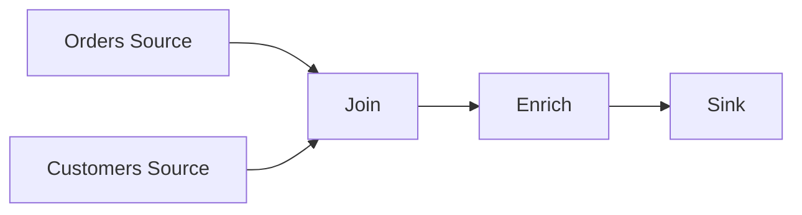

# Key Concepts

This page explains the three ideas you need to understand before building pipelines. No code - just the mental model.

## Nodes: The Building Blocks

A node is a single processing step. Every node does exactly one job:

- **Source nodes** bring data *into* the pipeline from the outside world (a file, a database, an API, or just a list in memory).
- **Transform nodes** receive data, do something to it, and pass the result forward (validate, filter, enrich, convert formats).
- **Sink nodes** send data *out of* the pipeline to a destination (write to a database, publish to a queue, save a file).

Think of nodes like stations on an assembly line. Raw materials enter at the first station, get shaped and refined at middle stations, and leave as finished products at the last station.

A pipeline must have at least one source and one sink. It can have any number of transforms in between (including zero).

## Streams: How Data Flows

Data moves between nodes through streams. A stream is a sequence of items delivered one at a time, asynchronously.

This is different from processing all data at once. Instead of loading an entire file into memory, a source can emit rows one by one. Each row flows through the transforms and into the sink before the next row is read. This means you can process files larger than your available memory.

*Data flows one item at a time through the pipeline. Each item passes through all connected nodes in sequence.*

Key properties of streams:

- **Asynchronous.** Nodes don't block while waiting for the next item. Other work can happen in the meantime.
- **Lazy.** Items are produced on demand. A source doesn't generate its next item until a downstream node is ready to consume it.
- **Typed.** Each stream carries items of a specific type. A stream of `Order` objects can only connect to a node that accepts `Order` as input. The compiler enforces this.

## Pipeline Graphs: The Big Picture

A pipeline is a directed graph of nodes connected by streams. The simplest pipeline is a straight line:

*A linear pipeline: one source, one transform, one sink.*

But pipelines can also branch, merge, and form more complex shapes:

*A branching pipeline: validated data goes to both a database and a log file.*

*A joining pipeline: data from two sources is combined before processing continues.*

The graph structure means:

- **Execution order is automatic.** NPipeline figures out which nodes to run first based on their connections. You don't manage ordering yourself.
- **Each node is independent.** Nodes don't know about each other. They only know about the data they receive and produce. This makes them easy to test in isolation.
- **The shape is declared, not coded.** You describe the graph (which nodes exist, how they connect) and NPipeline handles the execution mechanics.

## How These Concepts Fit Together

When you run a pipeline, this is what happens:

1. The **runner** reads your pipeline definition to understand the graph structure.
2. It creates instances of each **node**.
3. It opens **streams** between connected nodes.
4. **Source nodes** start producing items into their output streams.
5. **Transform nodes** consume items from their input stream, process them, and produce results into their output stream.
6. **Sink nodes** consume items from their input stream and perform final actions.
7. When all items have been processed, the runner cleans up and the pipeline completes.

You write the nodes and declare the graph. NPipeline does the rest.

## Next Steps

- [Your First Pipeline](your-first-pipeline.md) - if you haven't built one yet, start here
- [What Next?](what-next.md) - find the right guide for what you want to build
