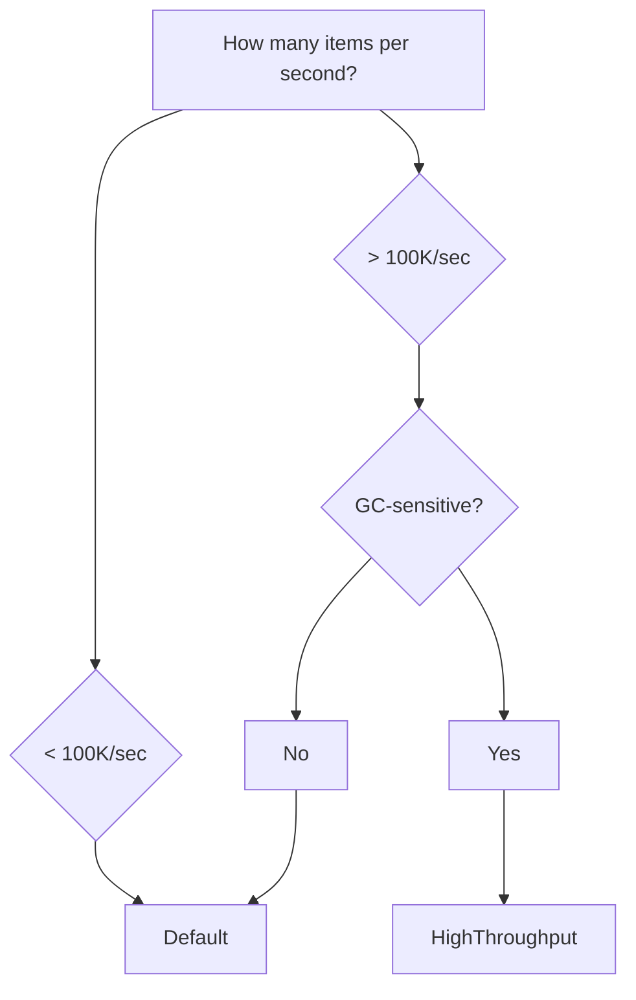

# Optimization Profiles

> **Prerequisites:** [Defining Pipelines](defining-pipelines.md), [Pipeline Context](pipeline-context.md)

`PipelineOptimizationProfile` is a single toggle that controls how aggressively NPipeline optimizes for throughput vs. developer convenience. It affects runtime defaults, context dictionary thread safety, and which [build-time analyzers](../analyzers/index.md) are active.

## The Two Profiles

| | Default | HighThroughput |
|--|---------|----------------|
| **Target use case** | Prototyping, low-to-medium throughput, developer velocity | Production pipelines processing millions of items/second |
| **Retry behavior** | Auto-configured: 3 retries, exponential backoff with jitter, 10K materialization cap | No retries unless explicitly configured |
| **Context dictionaries** | `ConcurrentDictionary` (thread-safe) | `Dictionary` (zero locking overhead) |
| **Performance analyzers** | NP9103–NP9107 suppressed | All analyzers active |
| **Memory model** | Slightly higher per-context allocation (concurrent collections) | Pooled dictionaries, minimal GC pressure |
| **Configuration style** | Batteries-included - works with minimal setup | Explicit-everything - you configure what you need |

## Setting the Profile

### At Runtime (PipelineBuilder)

```csharp
public class MyPipeline : IPipelineDefinition
{
    public void Define(PipelineBuilder builder, PipelineContext context)
    {
        builder.WithOptimizationProfile(PipelineOptimizationProfile.HighThroughput);

        // ... add nodes and connections ...
    }
}
```

### At Build Time (MSBuild)

The MSBuild property controls which analyzers fire during `dotnet build`:

```xml
<PropertyGroup>
    <NPipelineOptimizationProfile>HighThroughput</NPipelineOptimizationProfile>
</PropertyGroup>
```

These two settings represent the same decision from different angles. Set them to the same value - the runtime profile governs execution behavior, while the MSBuild property governs analyzer behavior.

When profile metadata is available (for example via the `NPipeline.Analyzers` package), NPipeline emits a runtime build warning if these values differ. This catches analyzer/runtime drift early.

## Default Profile

The `Default` profile is designed for the 90% case: developers who want a working pipeline with sensible error recovery and don't need to micro-optimize memory allocations.

### Automatic Retry Configuration

When no explicit retry options are configured, the `Default` profile applies:

| Setting | Value | Effect |
|---------|-------|--------|
| `MaxItemRetries` | 3 | Each failed item is retried up to 3 times before failing |
| `MaxMaterializedItems` | 10,000 | Buffers up to 10K items for node restart replay |
| `DelayStrategy` | Exponential backoff + full jitter | 1s base, 2× multiplier, 1min cap |
| `MaxNodeRestartAttempts` | 3 | Nodes can restart up to 3 times |
| `MaxSequentialNodeAttempts` | 5 | Sequential execution attempts capped at 5 |

These defaults activate automatically - no configuration needed:

```csharp
public void Define(PipelineBuilder builder, PipelineContext context)
{
    // Retry is already configured with sensible defaults.
    // Just define your pipeline graph:
    var source = builder.AddSource<OrderSource, Order>("orders");
    var transform = builder.AddTransform<ProcessOrder, Order, Result>("process");
    var sink = builder.AddSink<ResultSink, Result>("save");

    builder.Connect(source, transform);
    builder.Connect(transform, sink);
}
```

Override any individual setting without losing the rest:

```csharp
builder.WithRetryOptions(options => options with
{
    MaxItemRetries = 5  // Override just this; backoff and materialization cap remain
});
```

### Thread-Safe Context Dictionaries

In the `Default` profile, `PipelineContext.Parameters`, `.Items`, and `.Properties` are backed by `ConcurrentDictionary<string, object>`. This means:

- Concurrent reads and writes from parallel nodes do not throw or corrupt data.
- No need to add explicit locking for simple shared counters or flags.
- Safe to use with `NPipeline.Extensions.Parallelism` without additional synchronization for basic scenarios.

```csharp
// Safe in Default profile - ConcurrentDictionary handles concurrent writes
public override Task<Order> TransformAsync(
    Order item, PipelineContext context, CancellationToken ct)
{
    context.Items["lastProcessed"] = item.Id;  // thread-safe write
    return Task.FromResult(item);
}
```

> **Note:** Thread-safe dictionaries prevent crashes and data corruption, but they do not prevent logical race conditions. For complex shared state with checkpoint/restore semantics, use [`IPipelineStateManager`](parallel-execution.md#ipipelinestatemanager).

### Suppressed Performance Analyzers

The following analyzers are inactive in the `Default` profile because their rules target micro-optimizations that only matter at extreme throughput:

| Rule | Title | Why Suppressed |
|------|-------|----------------|
| NP9103 | LINQ in hot paths | LINQ allocations are negligible below millions of items/sec |
| NP9104 | Inefficient string operations | String concatenation overhead is irrelevant at moderate scale |
| NP9105 | Anonymous object allocation | Object allocation cost is insignificant for most workloads |
| NP9106 | ValueTask optimization | `Task.FromResult` vs `ValueTask` matters only at extreme throughput |
| NP9107 | Source node streaming | Materializing moderate datasets is acceptable for convenience |

All other analyzers (configuration, reliability, data integrity, design) remain active regardless of profile.

## HighThroughput Profile

The `HighThroughput` profile is for pipelines where every allocation counts - processing millions of items per second, sub-millisecond per-item latency targets, or GC-sensitive environments.

### Explicit Configuration Required

No automatic retry defaults are applied. You must configure every aspect of error handling explicitly:

```csharp
public void Define(PipelineBuilder builder, PipelineContext context)
{
    builder.WithOptimizationProfile(PipelineOptimizationProfile.HighThroughput);

    // Must explicitly configure retry if you want it
    builder.WithRetryOptions(options => options with
    {
        MaxItemRetries = 3,
        MaxMaterializedItems = 5000,
        MaxNodeRestartAttempts = 2
    });

    // Must explicitly add delay strategy
    builder.WithRetryOptions(options => options
        .WithExponentialBackoffAndFullJitter());

    // ... add nodes and connections ...
}
```

Or explicitly apply `Default` profile retry defaults while staying in `HighThroughput` runtime mode:

```csharp
builder.WithOptimizationProfile(PipelineOptimizationProfile.HighThroughput);
builder.WithRetry(PipelineOptimizationProfile.Default);
```

### Zero-Overhead Context Dictionaries

Context dictionaries use pooled `Dictionary<string, object>` instances - no locking, no memory barriers, no `ConcurrentDictionary` overhead:

- Dictionaries are rented from an object pool and returned on disposal.
- Zero per-access synchronization cost.
- **Not thread-safe.** Concurrent writes from parallel nodes cause data corruption.

When using parallel execution with `HighThroughput`, manage shared state through `IPipelineStateManager` or avoid writing to context dictionaries from transform nodes entirely.

### All Performance Analyzers Active

All NP9103–NP9107 analyzers fire at build time, catching:

- LINQ allocations in per-item transform methods
- String concatenation in loops
- Anonymous object allocation in hot paths
- Opportunities to use `ValueTask` fast paths
- Source nodes that materialize instead of streaming

This produces a stricter build experience that surfaces every potential allocation in the processing hot path.

### Memory and Performance Characteristics

| Aspect | Impact |
|--------|--------|
| Context dictionary access | ~0 overhead (no locks, no memory barriers) |
| Dictionary lifecycle | Pooled - no GC pressure from context creation/disposal |
| Per-item allocations | Analyzer-enforced: flagged at build time |
| Retry configuration | No hidden buffering or materialization unless explicitly configured |

## Retry Shorthand APIs

`WithRetry()` applies retry defaults for the currently selected runtime profile:

- `Default` runtime profile: 3 retries, exponential backoff + full jitter, 10,000-item materialization cap.
- `HighThroughput` runtime profile: strict baseline defaults (no retries unless explicitly configured).

```csharp
builder.WithRetry();
```

To apply retry defaults from a specific profile regardless of runtime profile, use `WithRetry(profile)`:

```csharp
builder.WithOptimizationProfile(PipelineOptimizationProfile.HighThroughput);
builder.WithRetry(PipelineOptimizationProfile.Default); // explicit, profile-specific convenience
```

The pipeline-level `Default` profile shorthand is equivalent to:

### Pipeline-Level

```csharp
builder.WithRetry(PipelineOptimizationProfile.Default);
// Equivalent to:
// builder.WithRetryOptions(options => options with
// {
//     MaxItemRetries = 3,
//     MaxMaterializedItems = 10_000,
//     MaxNodeRestartAttempts = 3,
//     MaxSequentialNodeAttempts = 5,
//     DelayStrategyConfiguration = /* exponential backoff + full jitter */
// });
```

### Node-Level

Apply retries to specific nodes while leaving others with pipeline-level defaults:

```csharp
var transform = builder.AddTransform<CallApi, Request, Response>("api-call");
transform.WithRetry(builder);  // Applies builder profile defaults

// Explicitly apply Default-profile retry defaults to this node
transform.WithRetry(builder, PipelineOptimizationProfile.Default);
```

Available on all node handle types: `SourceNodeHandle<T>`, `TransformNodeHandle<TIn, TOut>`, `SinkNodeHandle<TIn>`, and `AggregateNodeHandle<TIn, TOut>`.

## Choosing a Profile



| Scenario | Recommended Profile |
|----------|-------------------|
| Prototyping and development | Default |
| ETL jobs processing thousands to hundreds of thousands of records | Default |
| Real-time event processing at millions of items/sec | HighThroughput |
| Latency-sensitive financial data pipelines | HighThroughput |
| Batch jobs where simplicity matters more than throughput | Default |
| Microservice integrations with moderate load | Default |

## Interaction with Other Configuration

### Explicit Retry Always Wins

If you call `WithRetryOptions()` explicitly, your configuration is preserved regardless of profile:

```csharp
builder.WithOptimizationProfile(PipelineOptimizationProfile.Default);
builder.WithRetryOptions(options => options with { MaxItemRetries = 10 });
// Result: MaxItemRetries = 10, no automatic defaults applied
```

### .editorconfig Overrides

Individual analyzer rules can always be suppressed or promoted via `.editorconfig`, regardless of the MSBuild profile setting:

```ini
[*.cs]
# Suppress NP9103 even in HighThroughput mode
dotnet_diagnostic.NP9103.severity = none

# Enable NP9107 even in Default mode
dotnet_diagnostic.NP9107.severity = warning
```

### Parallelism Extension

The `NPipeline.Extensions.Parallelism` package works with both profiles. The key difference is context dictionary safety:

| Profile | Parallel Context Access | Recommendation |
|---------|------------------------|----------------|
| Default | Safe (ConcurrentDictionary) | Works out of the box for basic shared state |
| HighThroughput | Unsafe (Dictionary) | Use `IPipelineStateManager` or avoid context writes |

## Next Steps

- [Retry Strategies](../error-handling/retry-strategies.md) - fine-tune backoff algorithms and jitter
- [Parallel Execution](parallel-execution.md) - thread safety and state management
- [Build-Time Analyzers](../analyzers/index.md) - full rule reference
- [Performance Best Practices](../performance/best-practices.md) - optimization techniques for HighThroughput mode
