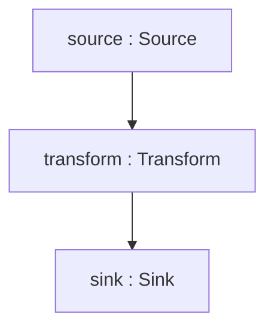

# Debugging Tips

> **Prerequisites:** [Defining Pipelines](../guides/defining-pipelines.md)

## Visualize the Pipeline Graph

### Mermaid Diagram

Export the pipeline graph as a Mermaid flowchart to see all nodes and connections:

```csharp
var graph = builder.Build();
var mermaid = PipelineGraphExporter.ToMermaid(graph);
Console.WriteLine(mermaid);
```

Output:



Paste the output into any Mermaid renderer (GitHub Markdown, VS Code preview, mermaid.live) to see the visual graph.

### Text Description

For a plain-text summary of all nodes and edges:

```csharp
var description = PipelineGraphExporter.Describe(graph);
Console.WriteLine(description);
```

Output includes each node's ID, name, kind, type, and input/output types, plus all edges.

## Validate Before Running

Catch structural issues before execution:

```csharp
// Check specific connections
bool canConnect = builder.CanConnect(sourceHandle, transformHandle);

// Validate the entire graph
var result = builder.Validate();
if (!result.IsValid)
{
    foreach (var error in result.Errors)
        Console.WriteLine($"{error.Rule}: {error.Message}");
}

// TryBuild returns errors instead of throwing
if (!builder.TryBuild(out var graph, out var errors))
{
    foreach (var error in errors)
        Console.WriteLine(error);
}
```

## Enable Detailed Logging

NPipeline logs pipeline activity through `ILogger`. Set the log level to `Debug` or `Trace` for detailed output:

```json
{
  "Logging": {
    "LogLevel": {
      "NPipeline": "Debug"
    }
  }
}
```

Key log categories:

- Node start/complete/error events
- Retry attempts and circuit breaker state changes
- Pipeline lifecycle (build, validate, execute, dispose)

## Inspect Pipeline Context

Access runtime state through `PipelineContext`:

```csharp
// In a node
public override async Task<Out> TransformAsync(In item, PipelineContext ctx, CancellationToken ct)
{
    // Check parameters
    var param = ctx.Parameters["key"];

    // Check shared items
    var shared = ctx.Items["shared-state"];

    // Access framework services
    var logger = ctx.Properties["Logger"] as ILogger;
    logger?.LogDebug("Processing item: {Item}", item);

    return result;
}
```

## Capture Errors in Tests

Use the testing harness to capture and inspect all errors:

```csharp
var result = await new PipelineTestHarness<MyPipeline>()
    .CaptureErrors()
    .RunAsync();

foreach (var error in result.Errors)
{
    Console.WriteLine($"Node: {(error as NodeExecutionException)?.NodeId}");
    Console.WriteLine($"Error: {error.Message}");
    Console.WriteLine($"Inner: {error.InnerException?.Message}");
}
```

## Inspect Dead Letter Queues

When items fail processing and are routed to the dead letter queue, inspect them:

```csharp
// Configure a policy that dead-letters failed items
var policy = ResiliencePolicyBuilder
    .ForNode<MyTransform, MyData>()
    .OnAny().DeadLetter()
    .Build();

builder.AddResiliencePolicy(policy);

// Use a custom dead letter sink to inspect failures
var deadLetterSink = new BoundedInMemoryDeadLetterSink();
builder.AddDeadLetterSink(deadLetterSink);

transform.WithResilience(builder);

// After pipeline execution, inspect dead-lettered items
foreach (var entry in deadLetterSink.Items)
{
    Console.WriteLine($"Dead letter: {entry.Item}");
    Console.WriteLine($"Reason: {entry.Exception.Message}");
}
```

## Common Debugging Workflow

1. **Visualize** the graph with `ToMermaid()` to confirm structure
2. **Validate** with `TryBuild()` to catch config errors
3. **Enable logging** at `Debug` level to see execution flow
4. **Add observability** to identify slow or failing nodes
5. **Use test harness** with `CaptureErrors()` for reproducible debugging

## Next Steps

- [Common Issues](common-issues.md) - symptom-based troubleshooting
- [Metrics and Monitoring](../observability/metrics-and-monitoring.md) - observe node performance
- [Pipeline Validation](../guides/pipeline-validation.md) - validation rules
